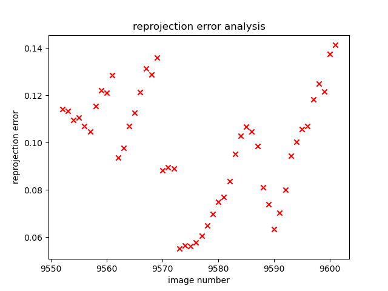

# Calibration, Stereo Vision and Image Depth Project

This repo contains two python scripts:
- **calibration.py**
- **stereoVision.py**

### Single Camera Calibration
Single camera calibration using chessboard + reprojection error. Pipeline includes data collection, corner detection, optimization of intrinsic/extrinsic camera parameters and reprojection error analysis.

Below is a calibration of one of the pictures in calibrationPics/. The blue circles represent the original detected corners and red cicles represent the reprojected points after calibration.

### Stereo Vision System
Stereo vision implementation using image pairs from three datasets. Pipeline performs feature matching, rectification and disparity map generation to produce heatmap illustration of disparity and depth